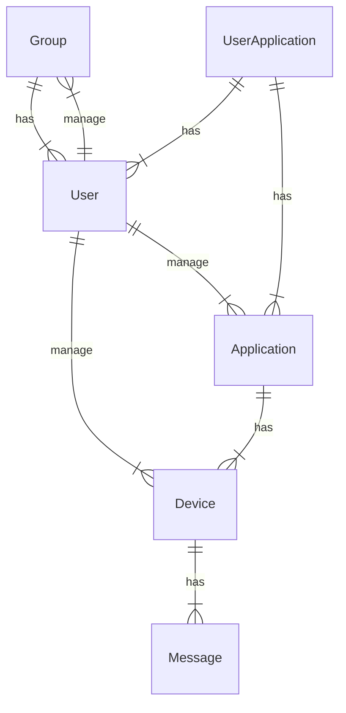

# MQTT 智能家居

[[TOC]]

## 1. 项目概述

### 1.1 项目特点概述

本项目致力于高性能、弹性可扩展、私有化、低延迟、权限可控的智能家居系统，主要构成是 MQTT 服务云端和本地物联网设备组成。

本地物联网设备是零耦合的，方案尽可能将各种传感器逻辑独立出来。可以弹性增加物联网模块。

私有化部署或本地部署，对云端没有完全依赖。可以冗余化部署，当云端不可用时自动连接本地的服务。

低成本，使用 ESP8266/ESP32 作为无线通讯芯片，使用 Rock Pi 3A 作为视频监控和本地冗余服务器。可使用机器学习框架搭建智能响应系统，可使用 NPU 进行神经网络推理，以获取更多的机器学习能力，总体成本大致只需 400 元。

权限可控，应用是管理设备组的基本单位，应用可以被用户自由创建和修改，并通过应用分配权限。这一点和现代公有云系统或 SaaS 系统很相似。

### 1.2 项目技术概述

技术选型：
- 使用 Rock Pi 3A 作为家庭云盒子
    - 其 AI 芯片的性价比远高于其他 AI 芯片
    - RK3568 芯片含有 NPU，支持快速的神经网络推理
    - 可以将云端部署方案冗余到盒子内
    - 支持视频捕获，使用 RTMP 视频流协议直播内容
- 使用 ESP8266 / ESP32 作为无线通讯芯片
    - 低成本
    - 易于接入和快速扩展
    - 接入烟雾传感器用于安全警报
    - 
- 使用 `asyncio` 为基础的 Python 服务
    - 分为 AMQTT 为基础的持久化服务和业务服务两大模块
    - `uvloop` 最快速的事件循环引擎，比 V8 / Node.js 事件循环快 2 倍左右
    - `sanic` 异步高性能 Web 服务框架
    - `aiomysql` 是 MySQL 异步驱动
    - `sqlalchemy` 应用最广泛数据库 ORM 框架，现已支持异步驱动
- Web 架构
    - 使用 Nginx 进行代理和反向代理
    - 使用 RTMP 配合 Nginx 插件搭建流媒体服务器，用于支持 RTMP 视频流协议直播
    - 使用 Docker / Docker-Compose 部署应用
- 使用 Vue3 + PWA 构建前端
    - PWA 是现代化的 Web 应用，可代替传统应用
    - Vue3 + TS + Vite4 方案
    - 使用 Naive UI 作为 UI 库

### 1.3 项目工作流程

终端设备和智能设备通过联网即可通信，由服务器提供全部通信服务。


室内传感器工作流程示意图：


服务端架构图：


## 2. 模型设计

### 2.1 总体模型

### 2.2 数据模型设计

实体如下：

|                              |                                                  |
| :--------------------------: | ------------------------------------------------ |
|         组（Group）          | 指家庭、团队、车间等形成的管理组                 |
|         用户（User）         | 用户实体                                         |
|     应用（Application）      | 应用抽象，含权限信息，对应 MQTT 服务器的用户 |
| 用户-应用（UserApplication） | 用户-应用多对多关系表                            |
|        设备（Device）        | 代表实际的物联网设备                             |
|       消息（Message）        | 设备的数据信息                                   |



## 3. MQTT 方案

### 3.1 MQTT 服务端

[EMQX](https://github.com/emqx/emqx) 是应用广泛的分布式 MQTT 服务器，特点是高性能、低延时。EMQX 主要使用 Erlang 编写，全面支持 MQTT 3.x 和 MQTT 5.0。

使用 Docker 创建服务器：

```bash
docker run -d --name emqx -p 1883:1883 -p 8083:8083 -p 8084:8084 -p 8883:8883 -p 18083:18083 emqx/emqx:latest
```

### 3.2 MQTT 客户端

作为服务，MQTT 客户端可运行在服务器中，维护与 MQTT 服务器的连接来获取数据。

其方案如下：
- 使用 AMQTT 配合 `asyncio` 来实现 MQTT 的发送接收
- 使用 `uvloop` 作为 `asyncio` 的引擎，达到接近系统级别的事件循环速度
- 使用 `sqlalchemy` 配合 `aiomysql` 来与数据库创建异步连接，用于持久化数据

客户端需要实时控制或获取数据，使用 WebSocket 协议进行通信。由客户端先向业务服务请求 MQTT 服务器的授权，然后使用授权访问 MQTT 服务器。

## 4. 客户端设计

### 4.1 前端设计

前端技术架构：
- Vue3 + Vite4 + TypeScript 基础架构
- Naive UI 作为 UI 库
- Pinia 存储模块
- Axios 网络请求模块

前端分为几个主要的工作页面：
- 主页
- 登录
- 注册
- 个人
- 设备管理
- 数据报表
